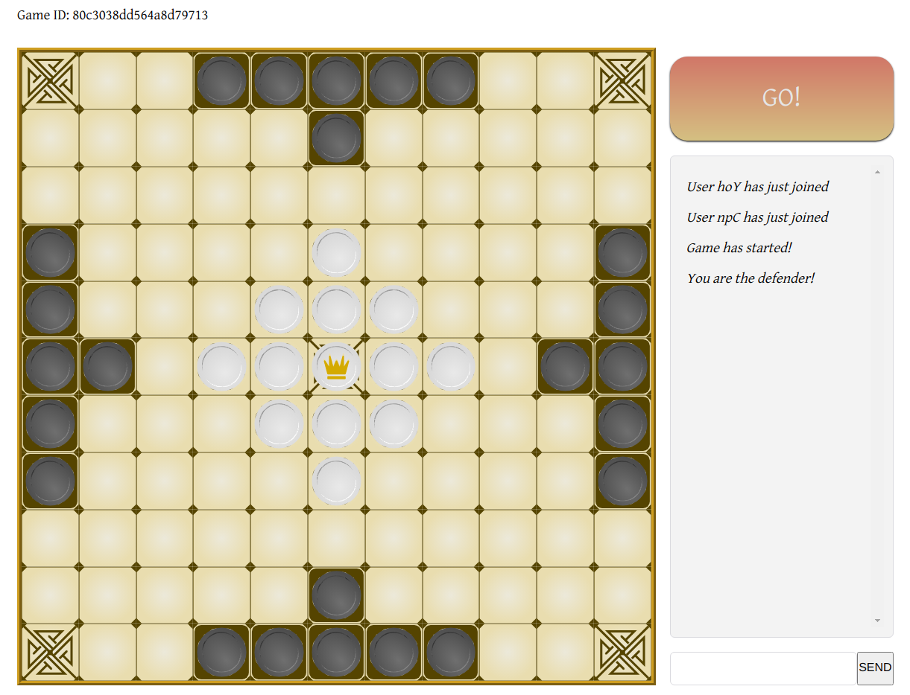

# Vikings Game

- [Overview](#Overview)
- [Improvements](#Improvements)
- [Commands](#Commands)

## Overview

Viking chess, or [Hnefatafl](https://en.wikipedia.org/wiki/Tafl_games), is a board game from the nordics, and this project is an online version of this game, which you can play [here](http://68.183.61.94/). The rules can be found [here](https://www.fetlar.org/assets/files/hnefatafl-rules-02-09-2012.pdf).

It works on **mobile** too.

The front-end was implemented with *React + Webpack*, and the backend with *Node + Express*. The multiplayer interaction was implemented with the *socket.io* package.

All art was created by me.

Sometimes the socket connection is closed after inactivity, especially on mobile. The fix is a to-do.

## Improvements

- Add sfx
- Add tests
- Add draw command

## Commands

When playing with your friend, you can type some commands in the chat:

- **Give Up**: 

Type `\gg` to give up. Your opponent automatically wins.

- **Swap Colors**: 

Type `\swap` to swap colors. If you are playing as the defender, you become the attacker, and vice-versa. After each rematch you and your opponent swap by default.

- **Undo a Move**: 

Type `\undo` to undo your move. You can also type this to undo your opponents move. You can keep undoing until you go back to the initial position. 

- **Draw**: 

This is a *to-do*. You are welcome to contribute with a pull request. :)
Both players must type `\draw` in the chat to agreed to a draw. 